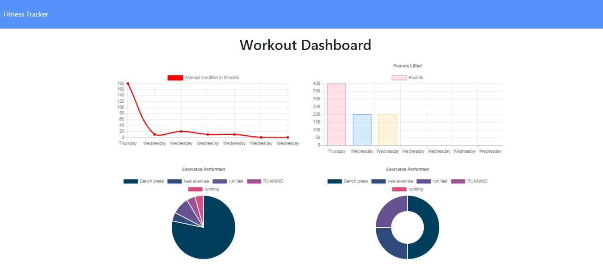
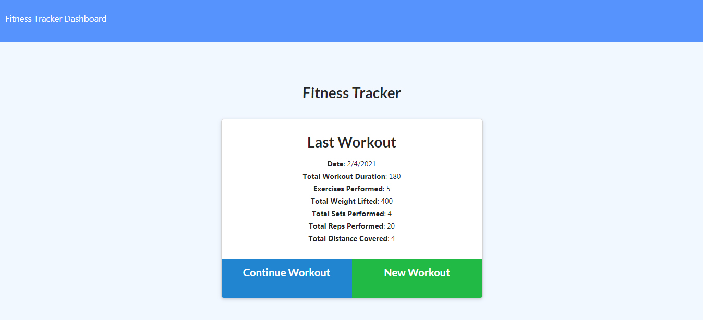
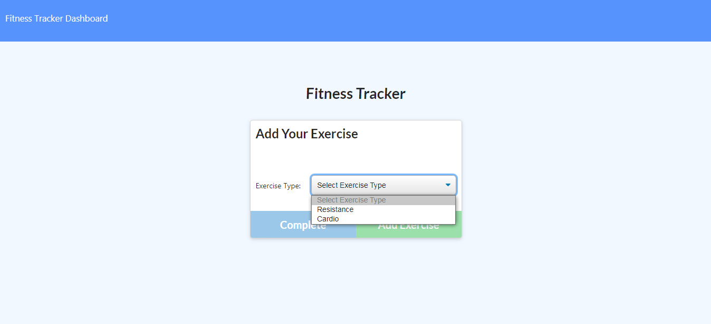
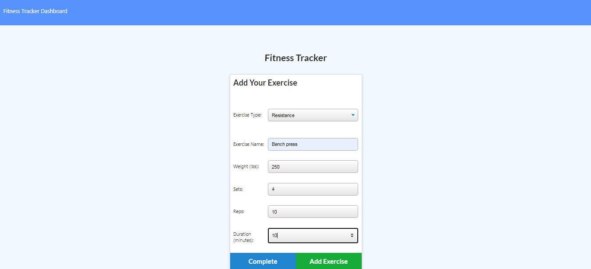

 [Link to my Portfolio, featuring my lastest apps](https://anaiva27.github.io/My-portfolio/portfolio.html) <br>
 [Link to the deployed app](https://fitness-tracker-ana.herokuapp.com/)

# Fitness Tracker Application
 

## Table of Contents
  * [Description](#Description)
  * [Installation](#Installation)
  * [Usage](#Usage)
  * [License](#License)

## Description
This application allows users to keep track of the fitness progress, keeping stats and presenting everything in graphs and diagrams using a variety of technologies and programming languages such as JavaScript, MongoDB, HTML, CSS, API requests, Ajax calls, Express.js and Node.js. The repository is organized according to MVC framework standarts. This full-stack app also introduces fun and intuitive interface.
<br>

## Installation
Fitness tracker application is deployed on Heroku platform, utilizing MongoDB Atlas. The webpage can be accessed by following the link at the top og the page.
To run this application on a local machine, the user will need to install Node.js and MongoDB, then initialize the folder containing the application by typing `npm init -y` and `npm i` in the command line to install required dependencies such as `express, mongoose, morgan logger`. The `package.json` will hold various metadata that's relevant to the project. Also the user has to run seeds script with `npm run seeds` located in the `seeders` folder in the root directory.

```
npm init -y 
npm i
npm run seeds
npm start
``` 
<br>

## Usage 

The user is presented with the index page with 2 options in the navbar: dashboard and a link to return back to the index page. If the app has been used before, then the user will see the stats of the previous workout, or it would be blank otherwise. After choosing the option to add a new workout, the user will see a drop down menu with options to add a cardio exercise or resistance. Then, after filling up the empty field, the user will be able to add more exercises or to complete the workout. 
<br>
The workout dashboard consists of graphs and diagrams that calculate total efforts of the last 7 workouts and then bring the total to the screen: the amount of pounds lifted and the total duration of the workout.
<br>

<br>
Screenshots:<br>
Stats page: <br> 

 <br>
<br>
Index page: <br>

 <br>

Choice of workouts: <br>
 <br>
<br>

Workout specifics: <br>
 <br>
<br>

## License
Copyright © 2020 Anastasia Ivashchenko

    Permission is hereby granted, free of charge, to any person obtaining a copy of this software and associated documentation files (the "Software"), to deal in the Software without restriction, including without limitation the rights to use, copy, modify, merge, publish, distribute, sublicense, and/or sell copies of the Software, and to permit persons to whom the Software is furnished to do so, subject to the following conditions:
    
    The above copyright notice and this permission notice shall be included in all copies or substantial portions of the Software.
    
    THE SOFTWARE IS PROVIDED "AS IS", WITHOUT WARRANTY OF ANY KIND, EXPRESS OR IMPLIED, INCLUDING BUT NOT LIMITED TO THE WARRANTIES OF MERCHANTABILITY, FITNESS FOR A PARTICULAR PURPOSE AND NONINFRINGEMENT. IN NO EVENT SHALL THE AUTHORS OR COPYRIGHT HOLDERS BE LIABLE FOR ANY CLAIM, DAMAGES OR OTHER LIABILITY, WHETHER IN AN ACTION OF CONTRACT, TORT OR OTHERWISE, ARISING FROM, OUT OF OR IN CONNECTION WITH THE SOFTWARE OR THE USE OR OTHER DEALINGS IN THE SOFTWARE.
    